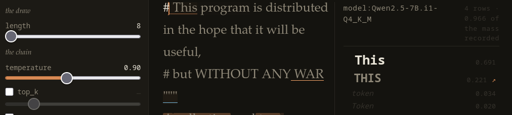

# token loom

**A machine output research tool: a trie over tokens, holding what else was ranked at every
position a generation passed through.**



*One strip across the instrument.* **Left**, what the next draw will be. **Middle**, a path set
as prose — each token underlined by who put it there, washed by a measure drawn over it.
**Right**, what else the model ranked where the reader is pointing, and what each was worth.
**It runs today**: [the whole page](docs/images/surface.png) is a screenshot away, and the tree
in that picture ships with this repository.

Givens go in, generations come out, and the surface exists to read *across* them. A generation
is not an answer to be accepted or rerolled; it is one path among those the model made
available, and several are held at once. That much is the interface this is named after —
inspired by [socketteer/loom](https://github.com/socketteer/loom), and the debt is conceptual
and real.

**What is different is that the record goes down to the token.** Every generation carries what
else was ranked at every position it passed through, so a path can be read against the
alternatives that were live along it — not just against its siblings. A branch can be taken at a
token the model ranked and did not sample. That is why the tree is a trie over tokens rather
than over text, and it is what the name is for.

## The idea and the implementation have different names

The idea is the **Autoregressive Interferometer**. An interferometer splits a signal, sends one
part down a reference arm and the other down a measurement arm, and reads what differs when they
recombine. Here the measurement arm is the path as it actually went — under whatever sampling,
with whatever interventions — and the reference arm is the model left alone from the same
position. What is read is the displacement between them.

**token loom** is the reference implementation, built to test that. It keeps the Loom debt in its
name, `tokenloom` is the package, and the two names are not interchangeable.

Four things separate this from the line it comes from, and only the first is visible in the
format:

- **A token-exact store.** Nothing is re-tokenised. Concatenating stored token ids is not the
  same object as tokenising the concatenated text — BPE merges across the join — so replay is
  the correct path and re-tokenisation the artefact.
- **A deterministic reference arm.** A temperature-zero run is a first-class probe, not one more
  sample.
- **Attractors as objects of study.** A repetition loop is located and used, not only avoided.
- **The operator as a variable.** The record is built to answer questions about how a person
  learns a fixed model.

## Running it

Local only, and that is upstream of everything else: the record needs per-token ids, bytes and
logprobs on a *raw continuation*, and no hosted provider returns those.

**Reading needs nothing but the repository.** `data/demo` is a tree that ships with this,
stamped, and reads take no lock and call no model — so the surface above is two commands from a
clone. A model is needed to *grow* a tree and not to read one.

**Its acts travel with it, and they are the method.** Every `generate` records the model it
asked and the parameters it asked under, so how the tree was built is in the tree rather than in
a note beside it. Reproduction is therefore a **replay of acts**, and what comes back differs by
as much as the sampler and the machine permit. Pinning a seed would narrow that and is not done:
what a tree is evidence of is a method and a model, not one path through them. **This is a
different replay from the one the format is built on** — concatenating stored token ids
reproduces a recorded path exactly, and that is a property of the record; replaying acts
re-runs the work and is a property of the method.

```sh
uv sync
uv run tokenloom serve data/demo --port 8097     # the picture above, on your machine
```

Everything past that wants the model running:

```sh
# a llama.cpp server with a base model, on 8081
scripts/llama-server.sh

uv run tokenloom init data/mine --vocab qwen2.5-7b-base
uv run tokenloom create data/mine 'It is a truth universally acknowledged, that'
uv run tokenloom generate data/mine --at 12 --length 80 --temperature 0.9
uv run tokenloom serve data/mine --port 8097     # the reading surface, at /
uv run tokenloom stamp data/mine                 # what it hashes to, for quoting a figure
```

`uv run tokenloom --help` lists the rest. Reads take no lock and need no server; `realise`,
`delete` and `undelete` need neither a server nor a tokeniser; `create` needs a tokeniser; only
`generate` calls a model. **Every write the surface can make, the command line can make** — the
five acts are `create`, `generate`, `realise`, `delete`, `undelete`, and each has a verb.
`stamp` is the sixth write and the only one that is not an act: it records what the tree hashed
to, and changes nothing about it.

`uv run pytest` needs no server. The live tests skip without one, and `-m live` runs only those.

## The documents

They point in one direction using different languages, and each is written against a different
test.

- **[`docs/PREMISE.md`](docs/PREMISE.md)** — why any of this is worth building: a context as a
  shared vocabulary between one reader and one model. **An essay. Nothing depends on it and
  nothing should**, which is what keeps it free to be wrong in the ordinary way an argument can
  be. Read it first or not at all.
- **[`docs/CORE.md`](docs/CORE.md)** — what the format *is*. Node, edge, source, ranking, act,
  the on-disk shape, the invariants, the operations. Written against one test: can someone
  implement a reader from it alone.
- **[`docs/ADAPTER.md`](docs/ADAPTER.md)** — what a backend must do to produce that record, and
  what to do when an obligation cannot be met.
- **[`docs/INTERFERENCE.md`](docs/INTERFERENCE.md)** — the method: a person standing in the
  sampler's slot, and a document grown by interference between two sources that meet on a
  vocabulary. *A sampler is a prosthesis for absent intent*, and greedy is the zero of a dial
  rather than a rule.
- **[`docs/SPINE.md`](docs/SPINE.md)** — the analysis the surface is built toward. The two arms
  and the conditions the reference arm is exact under, the measures, the failure mode where an
  operator closes the loop by hand, and what would count as this working. Its measurements are
  under *Evidence in hand*.
- **[`docs/SURFACE.md`](docs/SURFACE.md)** — the reading surface's design, **drafted and not
  accepted**. Written so that a reader can tell what is settled from what is open, and so that
  each open question says what would settle it.
- **[`docs/NEXT.md`](docs/NEXT.md)** — what gets built next and why in that order. **Living**:
  items are deleted once they close, so it never accumulates a history of itself.

`CLAUDE.md` is separate from all of these. It holds what is true about the code and easy to get
wrong, and it is not a place for direction.

## Where it is

**The format is built and the command line makes every write it admits.** `src/tokenloom/core/`
is the store — the five acts, the derived reads, and a checker for every named invariant — and
trees have been built against a running server.

**The surface reads and writes.** A page that lists a tree's roots, sets one path as prose,
continues it where the reader is pointing, shows what else was ranked at a position, and draws a
measure along the path. It is used daily, by one person, following paths that draw attention a
little more or a little less than the alternatives that were available.

**The conceptual work is ahead of the practical, by some margin.** That is the honest state of
it. What is unfinished lives in exactly two places: `docs/ADAPTER.md`'s Status for what the
backend leaves open, and `docs/NEXT.md` for what gets built. Every other document either states
what is, or argues.

One writer, one tree, one vocabulary, one person reading. None of that is a limitation to be
lifted later; each is load-bearing, and the documents say why.
